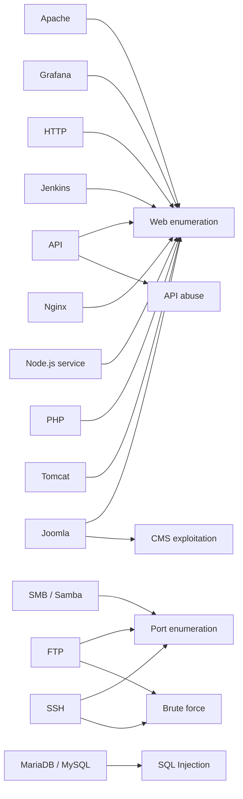
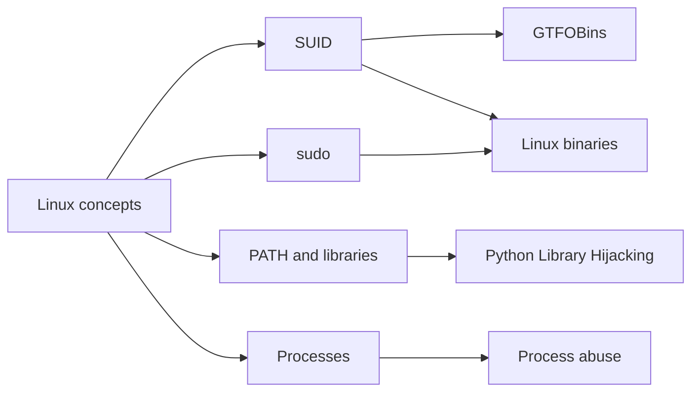

<!-- AUTO-GENERATED: BanditBox knowledge base. Safe to overwrite. -->

# Knowledge graph

Este grafo resume relaciones generadas desde evidencia textual del repositorio. Las relaciones inciertas se mantienen marcadas con `needs_review`.

## Maquinas, tecnicas, herramientas y servicios

```mermaid
graph TD
  M_backend[Backend]
  T_connectivity_check[Connectivity check]
  M_backend --> T_connectivity_check
  T_credential_extraction[Credential extraction]
  M_backend --> T_credential_extraction
  T_hash_cracking[Hash cracking]
  M_backend --> T_hash_cracking
  T_login_bypass[Login bypass]
  M_backend --> T_login_bypass
  T_port_enumeration[Port enumeration]
  M_backend --> T_port_enumeration
  O_burp_suite[Burp Suite]
  M_backend --> O_burp_suite
  O_find[find]
  M_backend --> O_find
  O_grep[grep]
  M_backend --> O_grep
  O_gtfobins[GTFOBins]
  M_backend --> O_gtfobins
  S_apache[Apache]
  M_backend --> S_apache
  S_http[HTTP]
  M_backend --> S_http
  S_mariadb_mysql[MariaDB / MySQL]
  M_backend --> S_mariadb_mysql
  S_ssh[SSH]
  M_backend --> S_ssh
  M_candy[Candy]
  T_cms_exploitation[CMS exploitation]
  M_candy --> T_cms_exploitation
  T_connectivity_check[Connectivity check]
  M_candy --> T_connectivity_check
  T_credential_extraction[Credential extraction]
  M_candy --> T_credential_extraction
  T_malicious_file_upload[Malicious file upload]
  M_candy --> T_malicious_file_upload
  T_metadata_analysis[Metadata analysis]
  M_candy --> T_metadata_analysis
  O_base64[base64]
  M_candy --> O_base64
  O_ciberchef[CiberChef]
  M_candy --> O_ciberchef
  O_find[find]
  M_candy --> O_find
  O_grep[grep]
  M_candy --> O_grep
  S_apache[Apache]
  M_candy --> S_apache
  S_http[HTTP]
  M_candy --> S_http
  S_joomla[Joomla]
  M_candy --> S_joomla
  S_php[PHP]
  M_candy --> S_php
  M_console_log[Console log]
  T_api_abuse[API abuse]
  M_console_log --> T_api_abuse
  T_cms_exploitation[CMS exploitation]
  M_console_log --> T_cms_exploitation
  T_connectivity_check[Connectivity check]
  M_console_log --> T_connectivity_check
  T_credential_extraction[Credential extraction]
  M_console_log --> T_credential_extraction
  T_port_enumeration[Port enumeration]
  M_console_log --> T_port_enumeration
  O_gtfobins[GTFOBins]
  M_console_log --> O_gtfobins
  O_nano[nano]
  M_console_log --> O_nano
  O_nmap[Nmap]
  M_console_log --> O_nmap
  O_nodejs[Node.js]
  M_console_log --> O_nodejs
  S_apache[Apache]
  M_console_log --> S_apache
  S_api[API]
  M_console_log --> S_api
  S_http[HTTP]
  M_console_log --> S_http
  S_joomla[Joomla]
  M_console_log --> S_joomla
  M_extraviado[Extraviado]
  T_connectivity_check[Connectivity check]
  M_extraviado --> T_connectivity_check
  T_credential_extraction[Credential extraction]
  M_extraviado --> T_credential_extraction
  T_metadata_analysis[Metadata analysis]
  M_extraviado --> T_metadata_analysis
  T_port_enumeration[Port enumeration]
  M_extraviado --> T_port_enumeration
  T_web_enumeration[Web enumeration]
  M_extraviado --> T_web_enumeration
  O_base64[base64]
  M_extraviado --> O_base64
  O_ciberchef[CiberChef]
  M_extraviado --> O_ciberchef
  O_nmap[Nmap]
  M_extraviado --> O_nmap
  O_ping[Ping]
  M_extraviado --> O_ping
  S_apache[Apache]
  M_extraviado --> S_apache
  S_http[HTTP]
  M_extraviado --> S_http
  S_ssh[SSH]
  M_extraviado --> S_ssh
  M_hiddencat[HiddenCat]
  T_brute_force[Brute force]
  M_hiddencat --> T_brute_force
  T_connectivity_check[Connectivity check]
  M_hiddencat --> T_connectivity_check
  T_credential_extraction[Credential extraction]
  M_hiddencat --> T_credential_extraction
  T_lfi[Local File Inclusion]
  M_hiddencat --> T_lfi
  T_malicious_file_upload[Malicious file upload]
  M_hiddencat --> T_malicious_file_upload
  O_find[find]
  M_hiddencat --> O_find
  O_gtfobins[GTFOBins]
  M_hiddencat --> O_gtfobins
  O_nmap[Nmap]
  M_hiddencat --> O_nmap
  O_ping[Ping]
  M_hiddencat --> O_ping
  S_apache[Apache]
  M_hiddencat --> S_apache
  S_http[HTTP]
  M_hiddencat --> S_http
  S_nginx[Nginx]
  M_hiddencat --> S_nginx
  S_ssh[SSH]
  M_hiddencat --> S_ssh
  M_internship[Internship]
  T_brute_force[Brute force]
  M_internship --> T_brute_force
  T_connectivity_check[Connectivity check]
  M_internship --> T_connectivity_check
  T_credential_extraction[Credential extraction]
  M_internship --> T_credential_extraction
  T_login_bypass[Login bypass]
  M_internship --> T_login_bypass
  T_malicious_file_upload[Malicious file upload]
  M_internship --> T_malicious_file_upload
  O_base64[base64]
  M_internship --> O_base64
  O_exiftool[ExifTool]
  M_internship --> O_exiftool
  O_grep[grep]
  M_internship --> O_grep
  O_netcat[Netcat]
  M_internship --> O_netcat
  S_apache[Apache]
  M_internship --> S_apache
  S_http[HTTP]
  M_internship --> S_http
  S_php[PHP]
  M_internship --> S_php
  S_ssh[SSH]
  M_internship --> S_ssh
  M_library[Library]
  T_brute_force[Brute force]
  M_library --> T_brute_force
  T_cms_exploitation[CMS exploitation]
  M_library --> T_cms_exploitation
  T_connectivity_check[Connectivity check]
  M_library --> T_connectivity_check
  T_credential_extraction[Credential extraction]
  M_library --> T_credential_extraction
  T_port_enumeration[Port enumeration]
  M_library --> T_port_enumeration
  O_ffuf_wfuzz[FFUF / WFuzz]
  M_library --> O_ffuf_wfuzz
  O_gobuster[Gobuster]
  M_library --> O_gobuster
  O_nmap[Nmap]
  M_library --> O_nmap
  O_ping[Ping]
  M_library --> O_ping
  S_apache[Apache]
  M_library --> S_apache
  S_ftp[FTP]
  M_library --> S_ftp
  S_http[HTTP]
  M_library --> S_http
  S_joomla[Joomla]
  M_library --> S_joomla
  M_move[Move]
  T_api_abuse[API abuse]
  M_move --> T_api_abuse
  T_connectivity_check[Connectivity check]
  M_move --> T_connectivity_check
  T_credential_extraction[Credential extraction]
  M_move --> T_credential_extraction
  T_hash_cracking[Hash cracking]
  M_move --> T_hash_cracking
  T_lfi[Local File Inclusion]
  M_move --> T_lfi
  O_burp_suite[Burp Suite]
  M_move --> O_burp_suite
  O_curl[curl]
  M_move --> O_curl
  O_ffuf_wfuzz[FFUF / WFuzz]
  M_move --> O_ffuf_wfuzz
  O_gobuster[Gobuster]
  M_move --> O_gobuster
  S_apache[Apache]
  M_move --> S_apache
  S_api[API]
  M_move --> S_api
  S_ftp[FTP]
  M_move --> S_ftp
  S_grafana[Grafana]
  M_move --> S_grafana
  M_nodeclimb[nodeclimb]
  T_connectivity_check[Connectivity check]
  M_nodeclimb --> T_connectivity_check
  T_credential_extraction[Credential extraction]
  M_nodeclimb --> T_credential_extraction
  T_hash_cracking[Hash cracking]
  M_nodeclimb --> T_hash_cracking
  T_port_enumeration[Port enumeration]
  M_nodeclimb --> T_port_enumeration
  T_sudo_abuse[sudo abuse]
  M_nodeclimb --> T_sudo_abuse
  O_find[find]
  M_nodeclimb --> O_find
  O_john_the_ripper[John the Ripper]
  M_nodeclimb --> O_john_the_ripper
  O_nmap[Nmap]
  M_nodeclimb --> O_nmap
  O_nodejs[Node.js]
  M_nodeclimb --> O_nodejs
  S_ftp[FTP]
  M_nodeclimb --> S_ftp
  S_nodejs_service[Node.js service]
  M_nodeclimb --> S_nodejs_service
  S_ssh[SSH]
  M_nodeclimb --> S_ssh
  M_pequenas_mentirosas[Pequeñas mentirosas]
  T_brute_force[Brute force]
  M_pequenas_mentirosas --> T_brute_force
  T_connectivity_check[Connectivity check]
  M_pequenas_mentirosas --> T_connectivity_check
  T_credential_extraction[Credential extraction]
  M_pequenas_mentirosas --> T_credential_extraction
  T_port_enumeration[Port enumeration]
  M_pequenas_mentirosas --> T_port_enumeration
  T_suid_abuse[SUID abuse]
  M_pequenas_mentirosas --> T_suid_abuse
  O_gtfobins[GTFOBins]
  M_pequenas_mentirosas --> O_gtfobins
  O_hydra[Hydra]
  M_pequenas_mentirosas --> O_hydra
  O_nmap[Nmap]
  M_pequenas_mentirosas --> O_nmap
  O_ping[Ping]
  M_pequenas_mentirosas --> O_ping
  S_apache[Apache]
  M_pequenas_mentirosas --> S_apache
  S_ftp[FTP]
  M_pequenas_mentirosas --> S_ftp
  S_http[HTTP]
  M_pequenas_mentirosas --> S_http
  S_ssh[SSH]
  M_pequenas_mentirosas --> S_ssh
  M_psycho[Psycho]
  T_connectivity_check[Connectivity check]
  M_psycho --> T_connectivity_check
  T_credential_extraction[Credential extraction]
  M_psycho --> T_credential_extraction
  T_lfi[Local File Inclusion]
  M_psycho --> T_lfi
  T_port_enumeration[Port enumeration]
  M_psycho --> T_port_enumeration
  T_python_library_hijacking[Python Library Hijacking]
  M_psycho --> T_python_library_hijacking
  O_nmap[Nmap]
  M_psycho --> O_nmap
  O_ping[Ping]
  M_psycho --> O_ping
  O_python[Python]
  M_psycho --> O_python
  O_ruby[Ruby]
  M_psycho --> O_ruby
  S_http[HTTP]
  M_psycho --> S_http
  S_php[PHP]
  M_psycho --> S_php
  S_ssh[SSH]
  M_psycho --> S_ssh
  M_reflection[Reflection]
  T_connectivity_check[Connectivity check]
  M_reflection --> T_connectivity_check
  T_credential_extraction[Credential extraction]
  M_reflection --> T_credential_extraction
  T_port_enumeration[Port enumeration]
  M_reflection --> T_port_enumeration
  T_suid_abuse[SUID abuse]
  M_reflection --> T_suid_abuse
  T_tty_stabilization[TTY stabilization]
  M_reflection --> T_tty_stabilization
  O_burp_suite[Burp Suite]
  M_reflection --> O_burp_suite
  O_find[find]
  M_reflection --> O_find
  O_nmap[Nmap]
  M_reflection --> O_nmap
  O_ping[Ping]
  M_reflection --> O_ping
  S_apache[Apache]
  M_reflection --> S_apache
  S_http[HTTP]
  M_reflection --> S_http
  S_php[PHP]
  M_reflection --> S_php
  S_ssh[SSH]
  M_reflection --> S_ssh
  M_secretjenkins[SecretJenkins]
  T_brute_force[Brute force]
  M_secretjenkins --> T_brute_force
  T_cms_exploitation[CMS exploitation]
  M_secretjenkins --> T_cms_exploitation
  T_connectivity_check[Connectivity check]
  M_secretjenkins --> T_connectivity_check
  T_credential_extraction[Credential extraction]
  M_secretjenkins --> T_credential_extraction
  T_lfi[Local File Inclusion]
  M_secretjenkins --> T_lfi
  O_grep[grep]
  M_secretjenkins --> O_grep
  O_nmap[Nmap]
  M_secretjenkins --> O_nmap
  O_ping[Ping]
  M_secretjenkins --> O_ping
  O_python[Python]
  M_secretjenkins --> O_python
  S_http[HTTP]
  M_secretjenkins --> S_http
  S_jenkins[Jenkins]
  M_secretjenkins --> S_jenkins
  S_joomla[Joomla]
  M_secretjenkins --> S_joomla
  S_php[PHP]
  M_secretjenkins --> S_php
  M_upload[Upload]
  T_connectivity_check[Connectivity check]
  M_upload --> T_connectivity_check
  T_credential_extraction[Credential extraction]
  M_upload --> T_credential_extraction
  T_malicious_file_upload[Malicious file upload]
  M_upload --> T_malicious_file_upload
  T_port_enumeration[Port enumeration]
  M_upload --> T_port_enumeration
  T_rce[Remote Code Execution]
  M_upload --> T_rce
  O_ffuf_wfuzz[FFUF / WFuzz]
  M_upload --> O_ffuf_wfuzz
  O_gobuster[Gobuster]
  M_upload --> O_gobuster
  O_gtfobins[GTFOBins]
  M_upload --> O_gtfobins
  O_netcat[Netcat]
  M_upload --> O_netcat
  S_apache[Apache]
  M_upload --> S_apache
  S_http[HTTP]
  M_upload --> S_http
  S_php[PHP]
  M_upload --> S_php
  M_verdejo[Verdejo]
  T_cms_exploitation[CMS exploitation]
  M_verdejo --> T_cms_exploitation
  T_connectivity_check[Connectivity check]
  M_verdejo --> T_connectivity_check
  T_credential_extraction[Credential extraction]
  M_verdejo --> T_credential_extraction
  T_hash_cracking[Hash cracking]
  M_verdejo --> T_hash_cracking
  T_malicious_file_upload[Malicious file upload]
  M_verdejo --> T_malicious_file_upload
  O_base64[base64]
  M_verdejo --> O_base64
  O_burp_suite[Burp Suite]
  M_verdejo --> O_burp_suite
  O_grep[grep]
  M_verdejo --> O_grep
  O_gtfobins[GTFOBins]
  M_verdejo --> O_gtfobins
  S_apache[Apache]
  M_verdejo --> S_apache
  S_http[HTTP]
  M_verdejo --> S_http
  S_joomla[Joomla]
  M_verdejo --> S_joomla
  S_php[PHP]
  M_verdejo --> S_php
  M_vulnvault[Vulnvault]
  T_cms_exploitation[CMS exploitation]
  M_vulnvault --> T_cms_exploitation
  T_connectivity_check[Connectivity check]
  M_vulnvault --> T_connectivity_check
  T_credential_extraction[Credential extraction]
  M_vulnvault --> T_credential_extraction
  T_lfi[Local File Inclusion]
  M_vulnvault --> T_lfi
  T_port_enumeration[Port enumeration]
  M_vulnvault --> T_port_enumeration
  O_base64[base64]
  M_vulnvault --> O_base64
  O_grep[grep]
  M_vulnvault --> O_grep
  O_nmap[Nmap]
  M_vulnvault --> O_nmap
  O_ping[Ping]
  M_vulnvault --> O_ping
  S_apache[Apache]
  M_vulnvault --> S_apache
  S_http[HTTP]
  M_vulnvault --> S_http
  S_joomla[Joomla]
  M_vulnvault --> S_joomla
  S_php[PHP]
  M_vulnvault --> S_php
  M_where_is_my_web_shell[Where Is My Web Shell]
  T_connectivity_check[Connectivity check]
  M_where_is_my_web_shell --> T_connectivity_check
  T_credential_extraction[Credential extraction]
  M_where_is_my_web_shell --> T_credential_extraction
  T_malicious_file_upload[Malicious file upload]
  M_where_is_my_web_shell --> T_malicious_file_upload
  T_port_enumeration[Port enumeration]
  M_where_is_my_web_shell --> T_port_enumeration
  T_rce[Remote Code Execution]
  M_where_is_my_web_shell --> T_rce
  O_ffuf_wfuzz[FFUF / WFuzz]
  M_where_is_my_web_shell --> O_ffuf_wfuzz
  O_gobuster[Gobuster]
  M_where_is_my_web_shell --> O_gobuster
  O_netcat[Netcat]
  M_where_is_my_web_shell --> O_netcat
  O_nmap[Nmap]
  M_where_is_my_web_shell --> O_nmap
  S_apache[Apache]
  M_where_is_my_web_shell --> S_apache
  S_http[HTTP]
  M_where_is_my_web_shell --> S_http
  S_php[PHP]
  M_where_is_my_web_shell --> S_php
  M_borazuwarahctf[BorazuwarahCTF]
  T_brute_force[Brute force]
  M_borazuwarahctf --> T_brute_force
  T_connectivity_check[Connectivity check]
  M_borazuwarahctf --> T_connectivity_check
  T_credential_extraction[Credential extraction]
  M_borazuwarahctf --> T_credential_extraction
  T_metadata_analysis[Metadata analysis]
  M_borazuwarahctf --> T_metadata_analysis
  T_port_enumeration[Port enumeration]
  M_borazuwarahctf --> T_port_enumeration
  O_exiftool[ExifTool]
  M_borazuwarahctf --> O_exiftool
  O_nmap[Nmap]
  M_borazuwarahctf --> O_nmap
  O_ping[Ping]
  M_borazuwarahctf --> O_ping
  O_ssh[ssh]
  M_borazuwarahctf --> O_ssh
  S_apache[Apache]
  M_borazuwarahctf --> S_apache
  S_ftp[FTP]
  M_borazuwarahctf --> S_ftp
  S_http[HTTP]
  M_borazuwarahctf --> S_http
  S_ssh[SSH]
  M_borazuwarahctf --> S_ssh
  M_breakmyssh[BreakMySSH]
  T_brute_force[Brute force]
  M_breakmyssh --> T_brute_force
  T_credential_extraction[Credential extraction]
  M_breakmyssh --> T_credential_extraction
  T_hash_cracking[Hash cracking]
  M_breakmyssh --> T_hash_cracking
  T_metadata_analysis[Metadata analysis]
  M_breakmyssh --> T_metadata_analysis
  T_port_enumeration[Port enumeration]
  M_breakmyssh --> T_port_enumeration
  O_curl[curl]
  M_breakmyssh --> O_curl
  O_find[find]
  M_breakmyssh --> O_find
  O_grep[grep]
  M_breakmyssh --> O_grep
  O_hydra[Hydra]
  M_breakmyssh --> O_hydra
  S_ftp[FTP]
  M_breakmyssh --> S_ftp
  S_http[HTTP]
  M_breakmyssh --> S_http
  S_ssh[SSH]
  M_breakmyssh --> S_ssh
  M_firsthacking[FirstHacking]
  T_credential_extraction[Credential extraction]
  M_firsthacking --> T_credential_extraction
  T_metadata_analysis[Metadata analysis]
  M_firsthacking --> T_metadata_analysis
  T_port_enumeration[Port enumeration]
  M_firsthacking --> T_port_enumeration
  T_web_enumeration[Web enumeration]
  M_firsthacking --> T_web_enumeration
  O_netcat[Netcat]
  M_firsthacking --> O_netcat
  O_nmap[Nmap]
  M_firsthacking --> O_nmap
  O_searchsploit[Searchsploit]
  M_firsthacking --> O_searchsploit
  S_ftp[FTP]
  M_firsthacking --> S_ftp
  M_hedgehog[HedgeHog]
  T_brute_force[Brute force]
  M_hedgehog --> T_brute_force
  T_connectivity_check[Connectivity check]
  M_hedgehog --> T_connectivity_check
  T_credential_extraction[Credential extraction]
  M_hedgehog --> T_credential_extraction
  T_port_enumeration[Port enumeration]
  M_hedgehog --> T_port_enumeration
  T_sudo_abuse[sudo abuse]
  M_hedgehog --> T_sudo_abuse
  O_nmap[Nmap]
  M_hedgehog --> O_nmap
  O_ping[Ping]
  M_hedgehog --> O_ping
  O_ssh[ssh]
  M_hedgehog --> O_ssh
  O_sudo[sudo]
  M_hedgehog --> O_sudo
  S_ftp[FTP]
  M_hedgehog --> S_ftp
  S_http[HTTP]
  M_hedgehog --> S_http
  S_ssh[SSH]
  M_hedgehog --> S_ssh
  M_injection[Injection]
  T_brute_force[Brute force]
  M_injection --> T_brute_force
  T_credential_extraction[Credential extraction]
  M_injection --> T_credential_extraction
  T_login_bypass[Login bypass]
  M_injection --> T_login_bypass
  T_port_enumeration[Port enumeration]
  M_injection --> T_port_enumeration
  T_sql_injection[SQL Injection]
  M_injection --> T_sql_injection
  O_find[find]
  M_injection --> O_find
  O_nmap[Nmap]
  M_injection --> O_nmap
  O_ssh[ssh]
  M_injection --> O_ssh
  O_sudo[sudo]
  M_injection --> O_sudo
  S_apache[Apache]
  M_injection --> S_apache
  S_http[HTTP]
  M_injection --> S_http
  S_ssh[SSH]
  M_injection --> S_ssh
  M_obsession[Obsession]
  T_brute_force[Brute force]
  M_obsession --> T_brute_force
  T_connectivity_check[Connectivity check]
  M_obsession --> T_connectivity_check
  T_credential_extraction[Credential extraction]
  M_obsession --> T_credential_extraction
  T_port_enumeration[Port enumeration]
  M_obsession --> T_port_enumeration
  T_web_enumeration[Web enumeration]
  M_obsession --> T_web_enumeration
  O_nmap[Nmap]
  M_obsession --> O_nmap
  O_ping[Ping]
  M_obsession --> O_ping
  O_sudo[sudo]
  M_obsession --> O_sudo
  O_vim[Vim]
  M_obsession --> O_vim
  S_ftp[FTP]
  M_obsession --> S_ftp
  S_http[HTTP]
  M_obsession --> S_http
  M_tproot[Tproot]
  T_connectivity_check[Connectivity check]
  M_tproot --> T_connectivity_check
  T_port_enumeration[Port enumeration]
  M_tproot --> T_port_enumeration
  O_netcat[Netcat]
  M_tproot --> O_netcat
  O_nmap[Nmap]
  M_tproot --> O_nmap
  O_ping[Ping]
  M_tproot --> O_ping
  O_searchsploit[Searchsploit]
  M_tproot --> O_searchsploit
  S_ftp[FTP]
  M_tproot --> S_ftp
  M_trust[Trust]
  T_brute_force[Brute force]
  M_trust --> T_brute_force
  T_credential_extraction[Credential extraction]
  M_trust --> T_credential_extraction
  T_port_enumeration[Port enumeration]
  M_trust --> T_port_enumeration
  T_sudo_abuse[sudo abuse]
  M_trust --> T_sudo_abuse
  T_suid_abuse[SUID abuse]
  M_trust --> T_suid_abuse
  O_ffuf_wfuzz[FFUF / WFuzz]
  M_trust --> O_ffuf_wfuzz
  O_gobuster[Gobuster]
  M_trust --> O_gobuster
  O_gtfobins[GTFOBins]
  M_trust --> O_gtfobins
  O_hydra[Hydra]
  M_trust --> O_hydra
  S_apache[Apache]
  M_trust --> S_apache
  S_ftp[FTP]
  M_trust --> S_ftp
  S_http[HTTP]
  M_trust --> S_http
  S_php[PHP]
  M_trust --> S_php
  M_vacaciones[Vacaciones]
  T_brute_force[Brute force]
  M_vacaciones --> T_brute_force
  T_credential_extraction[Credential extraction]
  M_vacaciones --> T_credential_extraction
  T_port_enumeration[Port enumeration]
  M_vacaciones --> T_port_enumeration
  T_sudo_abuse[sudo abuse]
  M_vacaciones --> T_sudo_abuse
  T_suid_abuse[SUID abuse]
  M_vacaciones --> T_suid_abuse
  O_gtfobins[GTFOBins]
  M_vacaciones --> O_gtfobins
  O_nmap[Nmap]
  M_vacaciones --> O_nmap
  O_ruby[Ruby]
  M_vacaciones --> O_ruby
  O_ssh[ssh]
  M_vacaciones --> O_ssh
  S_apache[Apache]
  M_vacaciones --> S_apache
  S_http[HTTP]
  M_vacaciones --> S_http
  S_ssh[SSH]
  M_vacaciones --> S_ssh
```

## Servicios y enumeracion



## Escalada de privilegios y Linux



## Estadisticas

| Relacion | Conteo |
|---|---:|
| Maquina -> tecnica | 187 |
| Maquina -> herramienta | 193 |
| Maquina -> servicio | 102 |
